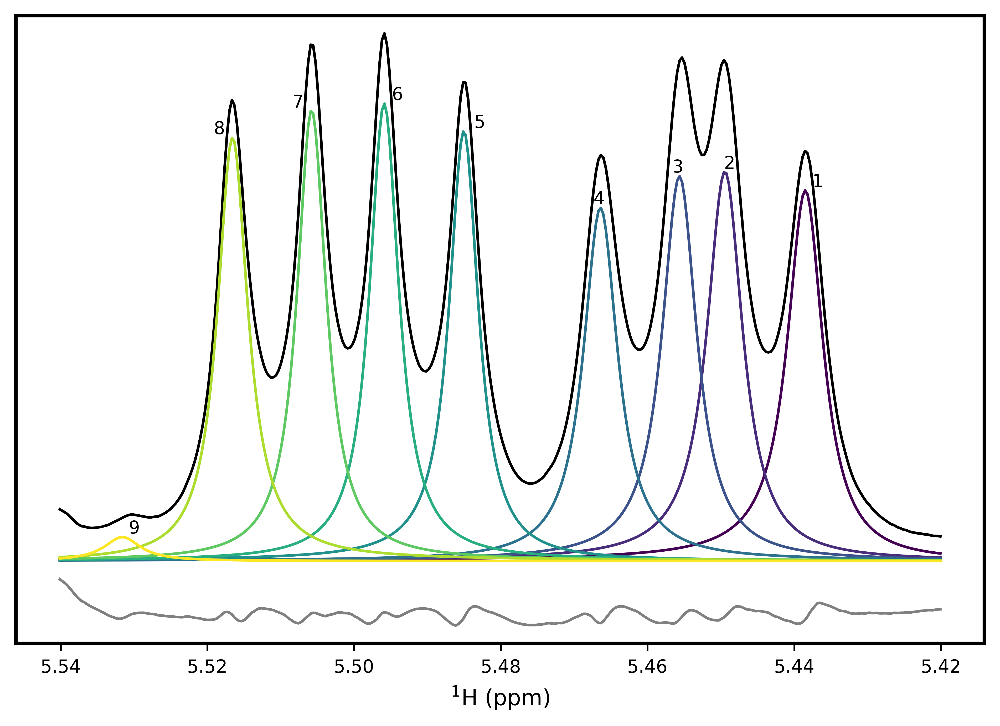

.. image:: nmrespy/images/nmrespy_full.png
   :scale: 25 %
   :align: center

NMR-EsPy: **N**\uclear **M**\agnetic **R**\esonance **Es**\timation in **Py**\thon
is a Python package developed for estimating the parameters that describe
NMR data.

Getting started:

* Installation: ``pip install nmrespy``
* Documentation: https://nmr-espy.readthedocs.io/en/latest/index.html
* Check out the `Example Walkthrough <https://nmr-espy.readthedocs.io/en/latest/walkthrough.html>`_
  page in the docs for a tutorial on NMR-EsPy's basic usage.

