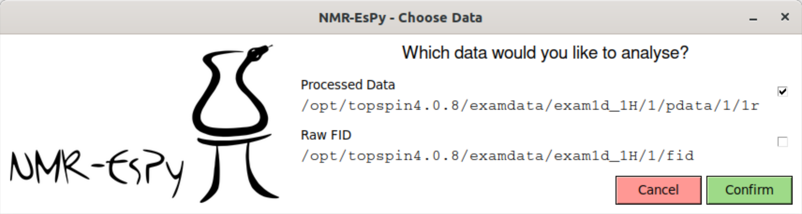
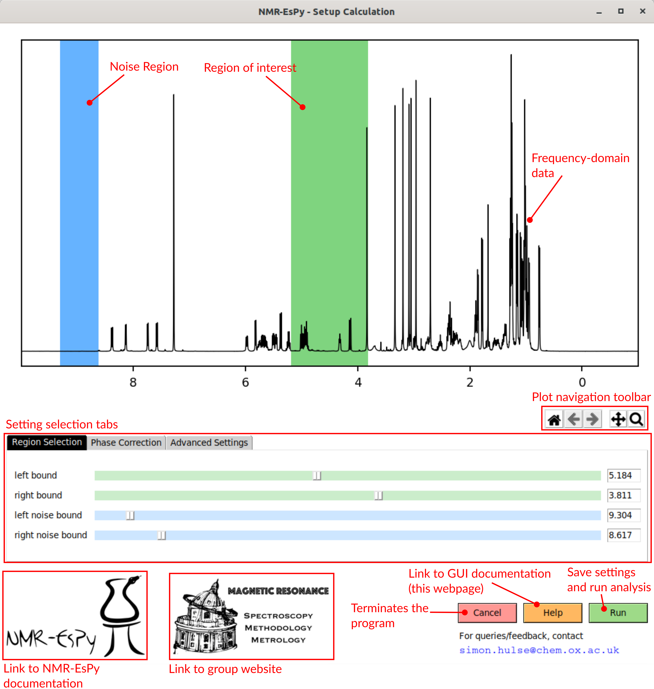

The NMR-EsPy GUI
================

The majority of the functionality that NMR-EsPy provides can implemented using
a Graphical User Interface (GUI). Here, I outline how to use the GUI in detail.

Invoking the GUI
^^^^^^^^^^^^^^^^

From the Command Line
---------------------

Yet to implement

From TopSpin
------------

After installation of NMR-EsPy using ``pip``, provided you opted to install
the TopSpin GUI, you can simply load the GUI in the following steps:

1. Load the data of interest from the
2. Enter ``nmrespy`` in the command line at the bottom-left of the TopSpin
   window.

Selecting the Data Type
^^^^^^^^^^^^^^^^^^^^^^^

NMR-EsPy is able to process data from ``fid`` or ``ser`` files, and data
inside the ``pdata`` directory.

After entering ``nmrespy`` in TopSpin, you will see this window:

Here you can select which data type to consider. In the example, we will load
the processed data, for which the real component is in the ``1r`` file.

A few notes of caution
----------------------

**Using data from an fid file:** A side-effect of high-frequency oversampling
used by modern Bruker spectrometers is the appearence of a `group delay` at the
start of the FID. More details are provided in `this blogpost. <http://nmr-analysis.blogspot.com/2008/02/why-arent-bruker-fids-time-corrected.html>`_
In order to overcome this issue, it is necessary to first enter the command
``convdta`` into the TopSpin command line to perform the required phase shift.

**Using pdata:** If you wish to analyse processed data, it is important to note
that you should not use data which has been subjected to window functions, since
NMR-EsPy models time-domian NMR data as being exponentially damped. Zero-filling
should be fine however.

Setting up a Calculation
^^^^^^^^^^^^^^^^^^^^^^^^

After choosing the data type, the Calculation set-up window will appear:

The data is plotted in the frequency domain. The plot is also highlighted
