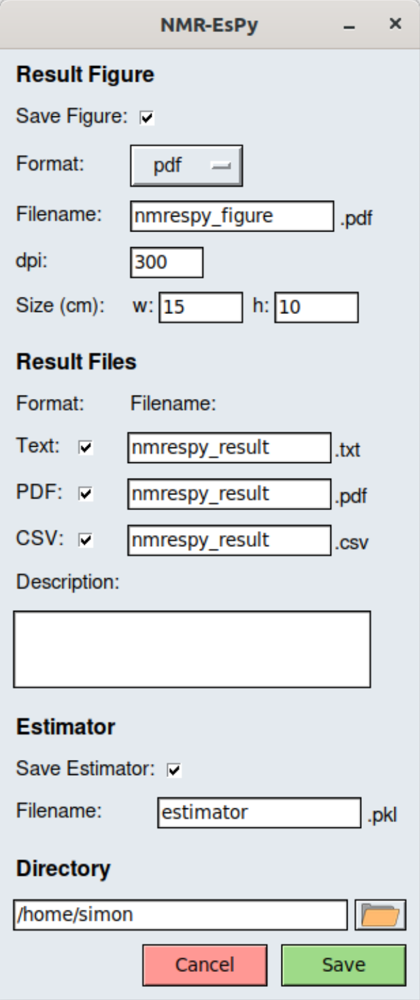

Using The GUI
=============

.. note::

   On this page, ``<pyexe>`` denotes the symbolic link/path to the Python
   executable you are using.

Loading the GUI
^^^^^^^^^^^^^^^

The GUI can be loaded both from a terminal/command prompt, or from within
TopSpin, provided the GUI loader has been installed
(see :ref:`Integrating the GUI into TopSpin <TS_install>`).

From a terminal
---------------

To set-up an estimation routine from the terminal/command prompt,
enter the following command:

.. code:: none

   $ <pyexe> -m nmrespy --estimate <path_to_bruker_data>

.. note::

   The shorthand flag ``-e`` can be used in place of ``--estimate``.

``<path_to_bruker_data>`` should be one of the following:

* The path to the parent directory of the raw time-domain data (``fid``).
* The path to the parent directory of the processed data (``1r``).

From TopSpin
------------

To load the GUI from TopSpin, simply select the data you wish to look at,
and then enter the command ``nmrespy`` into the prompt in the bottom left
corner.

You will be asked to select the data you wish to consider (either the
raw time-domain data, or the processed data):

.. image:: ../_static/gui/windows/datatype.png
   :align: center
   :scale: 70%

Estimation Set-up
^^^^^^^^^^^^^^^^^

The following is a screenshot of the NMR-EsPy GUI calculation set-up window.
Key features of the window are annotated:

.. image:: ../_static/gui/windows/setup_window.png
   :align: center
   :scale: 60%

Plot Navigation
---------------

The Plot navigation toolbar is an edited version of Matplotlib's default
toolbar, with the following buttons:

.. list-table::
   :header-rows: 1
   :widths: 1 8

   * - Icon
     - Role

   * - .. image:: ../_static/gui/navigation_icons/home.png
          :width: 60%
     - Return to the original plot view.

   * - .. image:: ../_static/gui/navigation_icons/back.png
          :width: 60%
     - Return to the previous plot view.

   * - .. image:: ../_static/gui/navigation_icons/forward.png
          :width: 60%
     - Undo a return to a previous view

   * - .. image:: ../_static/gui/navigation_icons/pan.png
          :width: 60%
     - Pan. Note that panning outside the spectral window is not possible.

   * - .. image:: ../_static/gui/navigation_icons/zoom.png
          :width: 60%
     - Zoom.

Phase Correction
----------------

The GUI has the following appearance when the `Phase Correction` tab is
selected:

.. image:: ../_static/gui/windows/setup_window_phase_tab.png
   :align: center
   :scale: 60%

When this tab is selected it is possible to phase the data, by editing the
pivot (red line in the above figure), zero-order phase and first-order phase.
This is unlikely to be necessary if you are considering processed data, however
you will probably need to do this if you are considering the raw time-domain
data.

The values may be changed either by adjusting the scale widgets, or by manually
inputting desired values into the adjacent entry boxes.

.. note::

   **Validating entry box inputs**

   For the majority of entry boxes in the GUI, you will notice that the box
   will turn red after you manually change it's contents. This indicates
   that the input value has been `unverified`. After you have changed the value
   in an entry box, press ``<Return>``. If the value you have provided is
   valid for the given parameter, the entry box will go back to its normal
   state with the new value present. If the value provided is invalid for
   whatever reason, the entry box will revert back to the previous value.

   The video below illustrates this. Initially, I try to change the value
   of the pivot to 7ppm. As soon as the entry box is changed, it goes red,
   indicating that it needs validating. When ``<Return>`` is pressed, as 7 is
   a valid value for the pivot (it is a number, and is within the spectrum's
   sweep width), the pivot is changed accordingly. Note that it is changed to
   the closest valid value to the nearest 4dp, which happens to be 6.9999ppm
   in this case.

   After this, I try to change the pivot to the text ``invalid`` which of
   course makes no sense in the context of a pivot, which should be a number.
   As it is invalid, when ``<Return>`` is pressed, the pivot entry box back
   to the last valid value it had.

   .. raw:: html

      <video width="640" height="640" style="display:block; margin: 0 auto;" controls autoplay>
        <source src="../_static/gui/entry_widget_example.mp4" type="video/mp4">
        Your browser doesn't support the video tag
      </video>

Advanced Estimation Settings
----------------------------

Clicking the `Advanced Settings` button will load a window enabling various
aspects of the estimation routine to be tweaked:

.. image:: ../_static/gui/windows/advanced_settings_window.png
   :align: center

Below is a summary of the meaning of all of these parameters.

.. note::

   For the majority of cases, you should find that the default parameters
   provided will be suitable.

* **Signal Filter Options**

  The basic idea behind frequency-filtering the data is to apply a band-pass
  filter to the spectral data, and then to convert the spectrum back to the
  time domain. By applying this filter, a substantial amount of the spectrum
  becomes redundant, and so it can be appropriate the "cut" off regions that are
  not of interest. The basic idea is illustrated in this figure:

  .. image:: ../_static/gui/filter_cut/filter_cut.png
     :align: center
     :scale: 25%

  + `Cut signal` - Specifies whether or not to perform cutting of the spectrum.
    By default, this is selected.
  + `Cut width/filter width ratio` - Specifies how many points the cut signal
    will be composed of relative to the number of points the filter spans. This
    is set to 3 by default.

* **Matrix Pencil**

  The Matrix Pencil Method is a singular-value decomposition-based approach
  for estimating signal parameters. It is used in NMR-EsPy to generate an
  initial guess for numerical optimisation. It is possible to either manually
  choose how many oscillators to generate using the Matrix Pencil, or to
  estimate the number of oscillators using the Minimum Description Length.

  + `Datapoints to consider` - Specifies how many points in the filtered
    signal to consider. The fewer datapoints, the faster the Matrix Pencil
    will be. However, if too few datapoints are used, the result may be
    unreliable. If the signal contains fewer the 4096 (2¹²) points, the
    full signal will be considered by default. Otherwise, the first 4096 points
    will be considered.
  + `Use MDL` - Whether or not to use the Minimum Description Length.
    By default, the MDL will be used.
  + `Number of Oscillators` - The number of oscillators used in the Matrix
    Pencil Method. This can only be specified if `Use MDL` is unticked.

* **Nonlinear Programming**

  The result of the Matrix Pencil Method is fed into a nonlinear programming
  (NLP) routine to determine the final signal parameter estimate.

  + `Datapoints to consider` - Analogous to the parameter with the same name
    under **Matrix Pencil**. The cost of running NLP is less susceptible to
    increases in the number of datapoints, so the full signal will be analysed
    by default if it comprises 8192 (2¹³) points or fewer. Otherwise, the
    signal's first 8192 points will be considered by default.
  + `NLP algorithm` - The optimisation routine. This can be either
    `Trust Region` or `L-BFGS`. By default, Trust-Region is used. The primary
    difference between these methods is that for Trust-Region, the
    `Hessian matrix` (a matrix of second order derivatives) is computed
    explicitly. In L-BFGS, the Hessian is approximated. The upshot of this
    is that the Trust-Region routine tends to lead to convergence in fewer
    iterations, however each iteration takes longer to compute.
  + `Maximum iterations` - The largest number of iterations to perform before
    terminating an returning the result. The default value is dependent on
    the NLP algorithm used (200 if Trust-Region selected, 500 if L-BFGS
    selected).
  + `Optimise phase variance` - Specifies whether to consider the variance of
    oscillator phases during the estimation routine. If your data is derived
    from a well-phased spectrum, it is advised you have this selected.
  + `Amplitude threshold` - Sets a threshold, such that any oscillator in the
    final result with an amplitude below the threshold will be removed. The
    threshold is defined as
    :math:`a_{\mathrm{thold}} \lVert\boldsymbol{a}\rVert_2` where
    :math:`\lVert\boldsymbol{a}\rVert_2` is the Euclidian (L2) norm of the
    oscillator amplitudes, and :math:`a_{\mathrm{thold}}` is the specified
    threshold. By default, no such threshold will be applied to the data.

Once you are happy with the calculation setup, simply cluck the *Run* button.
You will find that details of the routine are output to the terminal as it
runs.

Estimation Result
^^^^^^^^^^^^^^^^^

Once the routine is complete, a new window will load with the following
appearance:

.. image:: ../_static/gui/windows/result_window.png
   :align: center

Featured in the plot are:

* A plot of the data of interest (black line).
* Individual peaks that comprise the estimation result (multi-coloured).
  Each of these is given a numerical label
* The residual between the data and the model (grey).

Saving the result
-----------------

Clicking the *Save* button loads the following window:

* **Result Figure**

  This section is used for specifying whether to save a result figure, and
  for customising some simple figure settings.

  + `Save Figure` - Whether to save a figure or not.
  + `Format` - The figure's file format. Valid options are ``eps``, ``png``,
    ``pdf``, ``jpg``, ``ps`` and ``svg``.
  + `Filename` - The name of the file to save the Figure to.
  + `dpi` - Dots per inch.
  + `Size (cm)` - The width and height of the figure, in centimeters.

  .. note::
    The most up-voted answer to
    `this Stack Overflow question <https://stackoverflow.com/questions/47633546/relationship-between-dpi-and-figure-size>`_ provides a good
    description of the relationship between figure size and dpi.

  .. note::
    Beyond specifying the dpi and size of the figure, the GUI does not provide
    any means of customising the appearance of the figure in this version.
    I intend to provide support of for in a future version.  At the moment,
    the only means of customising the figure is to do it by writing a Python
    script. I provide an outline of how you can achieve certain customisations
    :doc:`here <figure_customisation>`

* **Result Files**

  Used for saving a table of result parameters to various file formats.
  For each of the valid formats (``txt``, ``pdf``, and ``csv``), the associated
  tick-boxes are used for specifying whether or not to generate a file of that
  format. Adjacent to each tick-box is an entry box for specifying the name of
  the result file.

  Finally, the `Description` box can be used to enter a description relating
  to the estimation, which will be added to the result file(s).

* **Estimator**

  Used for saving (`"pickling" <https://docs.python.org/3/library/pickle.html>`_)
  the :py:class:`nmrespy.core.Estimator` class instance, associated with the
  estimation result.

  + `Save Estimator` - Specifies whether or not to save the estimator to a
    binary file.
  + `Filename` - The filename to save the estimator to.

* **Directory**

  The entry box is used to specify the path to the directory to save **all**
  specified files to. The full path can either be typed out manually, or
  selected, by loading the file navigation window, by pressing the button
  with a folder icon.

Clicking *Save* will result in all the specified files to be saved to the desired
paths. The application will also be closed.
