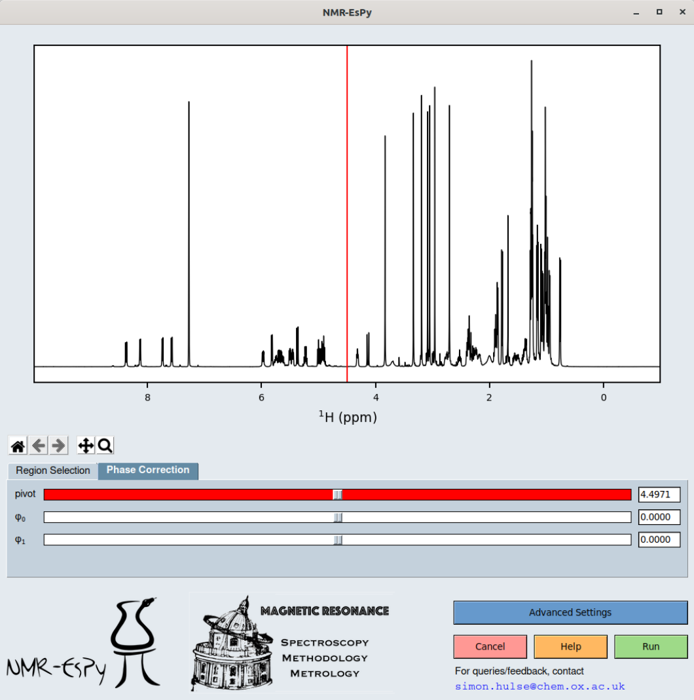

Using The GUI
=============

.. note::

   On this page, ``<pyexe>`` denotes the symbolic link/path to the Python
   executable you are using.

Loading the GUI
^^^^^^^^^^^^^^^

The GUI can be loaded both from a terminal/command prompt, or from within
TopSpin, provided the GUI loader has been installed
(see :ref:`Integrating the GUI into TopSpin <TS_install>`).

From a terminal
---------------

To set-up an estimation routine from the terminal/command prompt,
enter the following command:

.. code:: none

   $ <pyexe> -m nmrespy --estimate <path_to_bruker_data>

.. note::

   The shorthand flag ``-e`` can be used in place of ``--estimate``.

``<path_to_bruker_data>`` should be one of the following:

* The path to the parent directory of the raw time-domain data (``fid``).
* The path to the parent directory of the processed data (``1r``).

From TopSpin
------------

To load the GUI from TopSpin, simply select the data you wish to look at,
and then enter the command ``nmrespy`` into the prompt in the bottom left
corner.

You will be asked to select the data you wish to consider (either the
raw time-domain data, or the processed data):

.. image:: ../images_etc/gui/datatype.png
   :align: center
   :scale: 70%

Estimation Set-up
^^^^^^^^^^^^^^^^^

The following is a screenshot of the NMR-EsPy GUI calculation set-up window.
Key features of the window are annotated:

.. image:: ../images_etc/gui/setup_window.png
   :align: center
   :scale: 60%

Plot navigation
---------------

The Plot navigation toolbar is an edited version of Matplotlib's default
toolbar, with the following buttons:

.. list-table::
   :header-rows: 1
   :widths: 1 8

   * - Icon
     - Role

   * - .. image:: ../images_etc/gui/navigation_icons/home.png
          :width: 60%
     - Return to the original plot view.

   * - .. image:: ../images_etc/gui/navigation_icons/back.png
          :width: 60%
     - Return to the previous plot view.

   * - .. image:: ../images_etc/gui/navigation_icons/forward.png
          :width: 60%
     - Undo a return to a previous view

   * - .. image:: ../images_etc/gui/navigation_icons/pan.png
          :width: 60%
     - Pan. Note that panning outside the spectral window is not possible.

   * - .. image:: ../images_etc/gui/navigation_icons/zoom.png
          :width: 60%
     - Zoom.

Phase Correction
----------------

The GUI has the following appearance when the `Phase Correction` tab is
selected:

When this tab is selected it is possible to phase the data, by editing the
pivot (red line in the above figure), zero-order phase and first-order phase.
This is unlikely to be necessary if you are considering processed data, however
you will probably need to do this if you are considering the raw time-domain
data.

The values may be changed either by adjusting the scale widgets, or by manually
inputting desired values into the adjacent entry boxes.

.. note::

   **Validating entry box inputs**

   For the majority of entry boxes in the GUI, you will notice that the box
   will turn red after you manually change it's contents. This indicates
   that the input value has been `unverified`. After you have changed the value
   in an entry box, press ``<Return>``. If the value you have provided is
   valid for the given parameter, the entry box will go back to its normal
   state with the new value present. If the value provided is invalid for
   whatever reason, the entry box will revert back to the previous value.

   .. TODO - struggling to embed this video

   .. .. raw:: html
   ..
   ..    <video controls autoplay>
   ..      <source src="../images_etc/gui/entry_widget_example.mp4" type="video/mp4">
   ..      Your browser doesn't support the video tag
   ..    </video>

Region Selection
----------------

For typical NMR signals, the estimation routine used in NMR-EsPy is
too costly to analyse the entire signal. For this reason, it is typically
necessary to generate a signal which has been frequency-filtered, drastically
reducing the computation time, as well as the accuracy of the estimation.

* The region of interest is highlighted in :regiongreen:`green`.
* To perform the frequency filtering, it is also necessary to specify a region
  which appears to contain no signals (i.e. is pure noise). This is indicated
  in :regionblue:`blue`.

These regions can be adjusted by editing the scale widgets and entry boxes in
the `Region Selection` tab.

Advanced Estimation Settings
----------------------------
