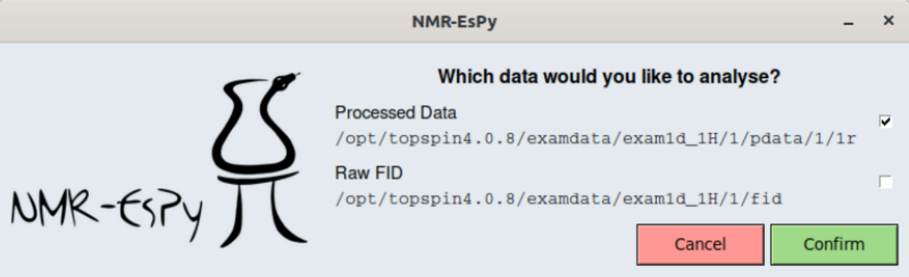

Loading the 1D GUI
==================

From a terminal
---------------

Enter the following:

.. code:: none

    $ <pyexe> -m nmrespy --setup1d /path/to/data

The data path can be of either of the following forms:

* ``<root>/<expno>``, where ``<expno>`` is an experiment number. Directly under
  this directory should be an ``fid`` file, as well as an ``acqus`` file.
* ``<root>/<expno>/pdata/<procno>``, where ``<procno>`` is a processed data
  number. Directly under this directory should be a ``1r`` file, as well as a
  ``procs`` file.

From TopSpin
------------

Assuming you have :ref:`installed the TopSpin scripts already <TOPSPIN_INSTALL>`,
load the 1D dataset of interest. Then, in the bottom left command prompt, enter
``espy1d``.

At this point, you will be prompted on whether you would like to import the raw
FID data (stored in the ``../../fid`` file) or the processed data (stored in
``1r``).

