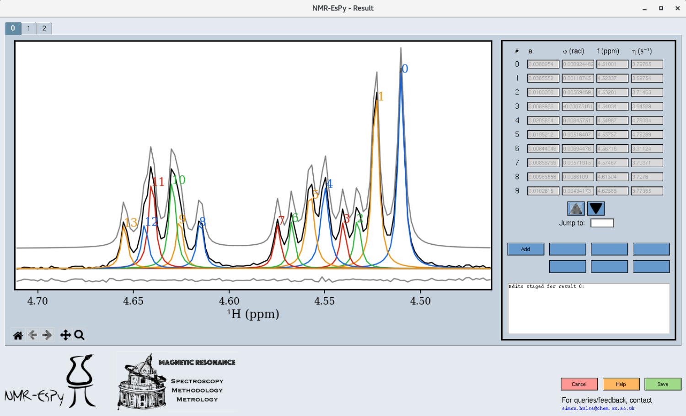

Reviewing estimation results
============================

Once the estimation routine is complete, you will see a window similar to this
one:

* In the top left are numbered tabs. These allow you to inspect each region in
  turn.
* The plot region shows the oscillators generated by the routine (coloured and
  numbered) along with the data itself (black). Above and below the plot in
  grey are the summation of all the oscillators (the model) and the residual,
  respectively.
* On the right-hand side is a table with all the parameters which make up the
  oscillators. You can navigate using the up and down arrow buttons, or by
  specifying an oscillator label to jump to.

Making edits to the result
--------------------------

It may be that there are certain aspects of the result which you feel are
incorrect. Possible examples include a particular peak being fit by more than
one oscillator (over-fitting), or two close-together peaks being fit by a
single oscillator (under-fitting). You can make *controlled* edits to the
result via the parameter table. There are 4 types of edit that NMR-EsPy
currently supports:

* *Add* oscillators to a result.
* *Remove* oscillators from a result.
* *Merge* oscillators together.
* *Split* an oscillator into multiple oscillators.

After edits have been made to the result, you are forced to re-run the
optimisation routine. This ensures (a) good fitting of the model to the data
(b) you cannot simply fudge the result!

Selecting oscillators
^^^^^^^^^^^^^^^^^^^^^

