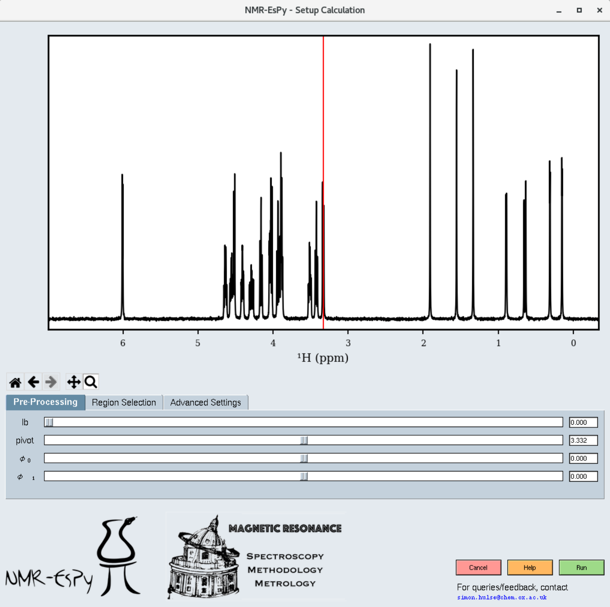

Setting up a 1D estimation
==========================

Assuming the path you have specified contains valid data, a window similar to
the following will appear:

You can explore the dataset with the following navigation icons located to the
bottom left of the plot:

.. list-table::
   :header-rows: 1
   :widths: 1 10

   * - Icon
     - Role

   * - .. image:: ../../media/gui/navigation_icons/home.png
          :width: 60%
          :align: center
     - Return to the original plot view.

   * - .. image:: ../../media/gui/navigation_icons/back.png
          :width: 60%
          :align: center
     - Return to the previous plot view.

   * - .. image:: ../../media/gui/navigation_icons/forward.png
          :width: 60%
          :align: center
     - Undo a return to a previous view

   * - .. image:: ../../media/gui/navigation_icons/pan.png
          :width: 60%
          :align: center
     - Pan. Note that panning outside the spectral window is not possible.

   * - .. image:: ../../media/gui/navigation_icons/zoom.png
          :width: 60%
          :align: center
     - Zoom.

Pre-processing
--------------

You will get the best results out of NMR-EsPy is you provide data that has been
phase-corrected, and has been baseline corrected. The pre-processing tab allows
you to carry out any required phase correction. You are likely to need to do
this if you have imported raw FID data. Baseline correction is applied to the
data automatically prior to estimation.

Region Selection
----------------

When you click on the "Region Selection" tab, you will see a few shaded regions
appear in the plot:

.. image:: ../../media/gui/windows/setup1d_region.png
   :align: center

* Coloured regions indicate the parts of the data you wish to estimate. The
  smaller you can keep these regions, the better, in terms of computational cost
  and result efficacy. However note that the bounds of each region should be at
  regions of the spectrum which are baseline (see the figure for appropriate
  examples).
* The grey region (called the noise region) is a special region which should
  not contain any signals.
* You can adjust each region by selecting the appropriate tab. To add an extra
  region, press the "+" tab.
* By default, NMR-EsPy uses a technique called the Minimum Description Length
  to estimate an appropriate number of oscillators to fit to a particular
  region. If you instead wish to provide a hard-coded value, untick the "Use
  MDL" checkbox, and insert an integer into the "number of oscillators" box.

Advanced Settings
-----------------

The "Advanced Settings" tab enables a few customisations to the optimisation
routine:

* The optimisation routine can either use the exact Hessian matrix, or a more
  efficient approximation, based on the Gauss-Newton method (default). This can
  be adjusted with the "optimisation method" drop-down. In general, we
  recommend you stick with "Gauss-Newton".
* The "maximum iterations" box allows you to adjust the number of iterations
  the optimiser is allowed to undertake before it is forced to terminate.
* The "optimise phase variance" checkbox allows you to specify whether you want
  the variance of oscillator phases to be included in the function to be
  optimised (fidelity). By default, assuming you have phased the data, you
  should have this on.

The bottom-right buttons
------------------------

* After you have set up the estimation routine, click the green "Run" button to
  execute it.
* The "Help" button loads this documentation.
* The "Cancel" button closes the GUI down.
