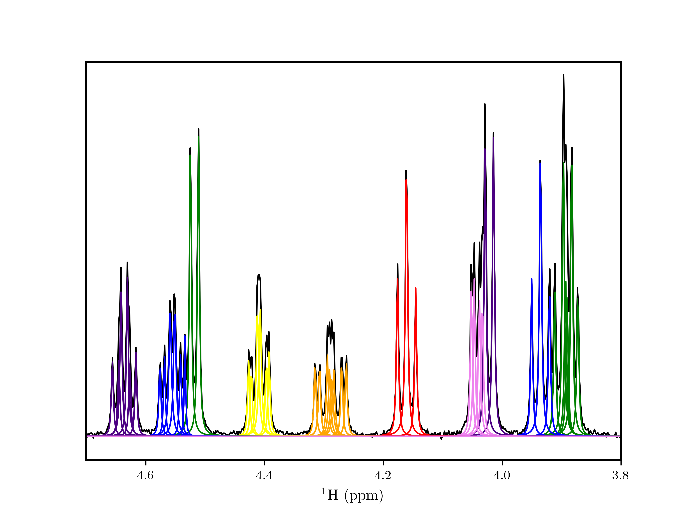
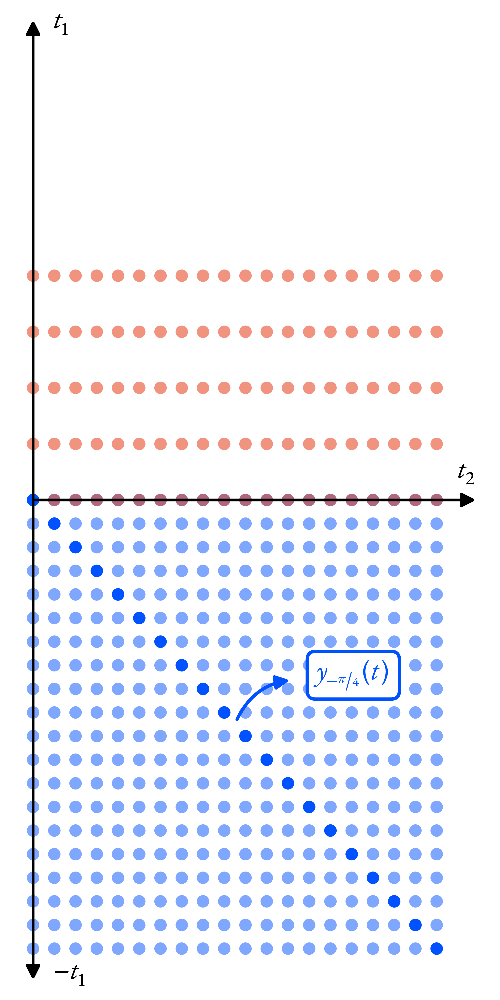
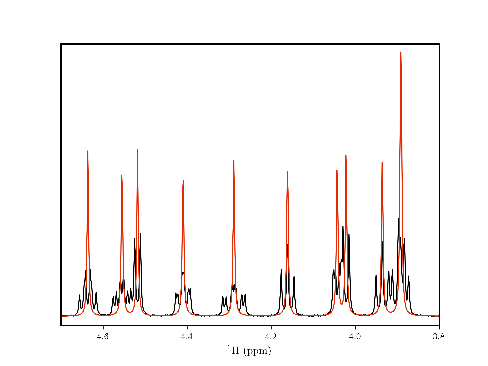

2DJ Walkthrough
===============

In this example, I will go through some of the most useful features of the
:py:class:`~nmrespy.Estimator2DJ` class for the consideration of data deived
from J-resolved (2DJ) experiments. We will be using a simulated ¹H 2DJ spectrum
of sucrose for this example. The data will be simulated using
`Spinach <https://spindynamics.org/wiki/index.php?title=Main_Page>`_, via the
:py:meth:`~nmrespy.Estimator2DJ.new_spinach` classmethod. In order to use this
method, you need to have a MATLAB installation, configured the `MATLAB Engine
for Python
<https://uk.mathworks.com/help/matlab/matlab_external/install-the-matlab-engine-for-python.html>`_,
and installed Spinach. If you do not have MATLAB, I have pre-simulated the data
too so you can still follow along.

Creating the estimator
----------------------

Start by importing NMR-EsPy and a few other things we will need:

.. code:: pycon

   >>> from pathlib import Path
   >>> import pickle
   >>> import matplotlib.pyplot as plt
   >>> import nmrespy as ne
   >>> directory = Path(ne.__file__).resolve().parent / "data/jres/sucrose_synthetic/"

We will set up a simulation with the following parameters:

* Time-points: 64 (T1), 4096 (T2)
* Sweep width: 40Hz (T1), 2200Hz (T2)
* Transmitter offset in F2: 1000Hz
* Field: 300MHz

.. code:: pycon

   >>> pts = (64, 4096)
   >>> sw = (40., 2200.)
   >>> offset = 1000.
   >>> field = 300.
   >>> field_unit = "MHz"

I can use ``new_spinach``
^^^^^^^^^^^^^^^^^^^^^^^^^

Load the chemical shifts and scalar couplings for sucrose. ``shifts`` and
``couplings`` have the following form:

* ``shifts``: A list of floats, with each value specifying the isotropic chemical
  shift in ppm.
* ``couplings`` A list of 3-element tuples, with each tuple of the form ``(i1:
  int, i2: int, x: float)``. ``i1`` and ``i2`` are the spins involved in the
  coupling (counting starts at 1…), and `x` is their scalar coupling in Hz.

.. code:: pycon

   >>> with open(directory / "shifts.pkl", "rb") as fh:
   ...     shifts = pickle.load(fh)
   ...
   >>> with open(directory / "couplings.pkl", "rb") as fh:
   ...     couplings = pickle.load(fh)
   ...
   >>> print(
   ...     "----- SHIFTS -----\n" +
   ...     "\n".join([f"{i:<5}{shift:.3f}ppm" for i, shift in enumerate(shifts, start=1)])
   ... )
   ----- SHIFTS -----
   1    6.005ppm
   2    3.510ppm
   3    3.934ppm
   4    3.423ppm
   5    4.554ppm
   6    3.891ppm
   7    4.287ppm
   8    3.332ppm
   9    1.908ppm
   10   1.555ppm
   11   0.644ppm
   12   4.042ppm
   13   4.517ppm
   14   3.889ppm
   15   4.635ppm
   16   4.160ppm
   17   4.021ppm
   18   4.408ppm
   19   0.311ppm
   20   1.334ppm
   21   0.893ppm
   22   0.150ppm
   >>> print(
   ...     "\n----- COUPLINGS -----\n" +
   ...     "\n".join([f"{i1:<3}- {i2:<5}{x:.3f}Hz" for i1, i2, x in couplings])
   ... )
   ----- COUPLINGS -----
   1  - 2    2.285Hz
   2  - 3    4.657Hz
   2  - 8    4.828Hz
   3  - 4    4.326Hz
   4  - 5    4.851Hz
   5  - 6    5.440Hz
   5  - 7    2.288Hz
   6  - 7    -6.210Hz
   7  - 11   7.256Hz
   12 - 13   -4.005Hz
   12 - 19   1.460Hz
   14 - 15   4.253Hz
   15 - 16   4.448Hz
   15 - 21   3.221Hz
   16 - 18   4.733Hz
   17 - 18   -4.182Hz
   18 - 22   1.350Hz

Now, create a new instance of :py:class:`~nmrespy.Estimator2DJ`. This will
probably take around a minute as the data will be simulated by Spinach at this
point:

.. code:: pycon

   >>> estimator = ne.Estimator2DJ.new_spinach(
   >>>     shifts,
   >>>     pts,
   >>>     sw,
   >>>     offset,
   >>>     couplings=couplings,
   >>>     field=field,
   >>>     field_unit=field_unit,
   >>> )

I cannot use ``new_spinach``
^^^^^^^^^^^^^^^^^^^^^^^^^^^^

I have pre-simulated the data in the case that you have not fulfilled the
requirements for ``new_spinach``. In order to directly use
:py:meth:`~nmrespy.Estimator2DJ.__init__`, you need to supply both the data of
interest and an instance of :py:class:`~nmrespy.ExpInfo`, which contains
relavent experiment parameters.

.. code:: pycon

   >>> with open(directory / "fid.pkl", "rb") as fh:
   ...     fid = pickle.load(fh)
   ...
   >>> # Need to add some noise to the dataset
   >>> fid = ne.sig.add_noise(fid, snr=30.)
   >>> expinfo = ne.ExpInfo(
   ...     dim=2, sw=sw, offset=(0., offset), sfo=(None, field), nuclei=(None, "1H"),
   ...     default_pts=pts,
   ... )
   >>> estimator = ne.Estimator2DJ(fid, expinfo)

Running the estimation routine
------------------------------

We will now estimate the entire signal by generating filtered "sub-signals" in
the direct dimension, and estimate each of these in turn. For the best results,
it is necessary to specifiy region bounds that do not coincide with peaks in
the direct-dimension spectrum, as this will lead to sub-signals which do not
satify the underlying assumptions about the signal's structure which NMR-EsPy
relies on.

.. code:: pycon

    >>> regions = (
    ...     (6.08, 5.91),
    ...     (4.72, 4.46),
    ...     (4.46, 4.22),
    ...     (4.22, 4.1),
    ...     (4.09, 3.98),
    ...     (3.98, 3.83),
    ...     (3.58, 3.28),
    ...     (2.08, 1.16),
    ...     (1.05, 0.0),
    >>> )
    >>> n_regions = len(regions)
    >>> common_kwargs = {
    ...     "noise_region": (5.5, 5.33),
    ...     "region_unit": "ppm",
    ...     "max_iterations": 40,
    ...     "nlp_trim": 512,
    ...     "fprint": False,
    ...     "phase_variance": True,
    >>> }
    >>> for i, region in enumerate(regions, start=1):
    ...     print(f"---> {i} / {n_regions}: {region[0]} - {region[1]}ppm")
    ...     kwargs = {**{"region": region}, **common_kwargs}
    ...     estimator.estimate(**kwargs)
    ...
    ---> 1 / 9: 6.08 - 5.91ppm
    ---> 2 / 9: 4.72 - 4.46ppm
    ---> 3 / 9: 4.46 - 4.22ppm
    ---> 4 / 9: 4.22 - 4.1ppm
    ---> 5 / 9: 4.09 - 3.98ppm
    ---> 6 / 9: 3.98 - 3.83ppm
    ---> 7 / 9: 3.58 - 3.28ppm
    ---> 8 / 9: 2.08 - 1.16ppm
    ---> 9 / 9: 1.05 - 0.0ppm

Predicting multiplets and removing spurious oscillators
-------------------------------------------------------
With the estimation complete, it is useful to predict which oscillators
correspond to particular multiplets, and if the are any oscillators which are
spurious in nature. In a 2DJ experiment, we expect peaks corresponding to a
particular multiplet to lie along a line at a 45° angle to the F1 and F2 axes.
Equivalently, we expect the indirect and direct dimension frequencies
:math:`f_{1,m}` and  :math:`f_{2,m}` for each peak in a multiplet to satisfy
:math:`f_{2,m} - f_{1,m} = f_{\mathrm{c}}`, where :math:`f_{\mathrm{c}}` is the
central frequency of the multiplet. Therefore, we expect :math:`f_{2,m} -
f_{1,m} = f_{\mathrm{c}}` for all peaks in a multiplet to be the same, withing
a certain threshold\*. With this in mind, it is possible to assign multiplets
to the estimation result.

Assigning multiplets provides a means of determining which oscillators are
probably spurious. If there are any oscillators which are not part of a
multiplet (i.e. they are assigned as a singlet by the multiplet prediction),
and which do not have an indirect dimension frequency close to 0Hz, the
implication is these oscillators are infeasible, and hence should be removed.

To remove any oscillators like this, you can use the
:py:meth:`~nmrespy.Estimator2DJ.remove_spurious_oscillators` method.

\*One sensible threshold is half the spectral resolution of the less-resolved
dimension, which is pretty much always the indirect dimension, so the threshold
can be set to :math:`N / 2f_{\mathrm{sw}, 1}`.

.. code:: pycon

   >>> estimator.remove_spurious_oscillators(
   ...     max_iterations=30,
   ...     phase_variance=True,
   ...     nlp_trim=512,
   ... )

Using the estimation result
---------------------------

Visualising multiplets
^^^^^^^^^^^^^^^^^^^^^^

The :py:meth:`~nmrespy.Estimator2DJ.plot_multiplets` method generates a
matplotlib figure of the 1D spectrum (the FT of the first slice in T1), along
with plots of each peak determined via estimation. Each peak belonging to the
same multiplet is given the same colour.

.. code:: pycon

   >>> fig = estimator.plot_multiplets()
   >>> # For greater clairty, I'm going to focus on a specific region: 4.7-3.8ppm
   >>> ax = fig.get_axes()[0]
   >>> ax.set_xlim(4.7, 3.8)
   (4.7, 3.8)
   >>> prev_ylim = ax.get_ylim()
   >>> ax.set_ylim(prev_ylim[0], 0.55 * prev_ylim[1])
   (-1.7384434309228578, 25.05441193704834)
   >>> fig.savefig("multiplets.png")

Generating a homodecoupled spectrum
^^^^^^^^^^^^^^^^^^^^^^^^^^^^^^^^^^^

The estimation results leaves us in a position to generate a homodecoupled 1D
signal, without loss in sensitivity\*

The :py:meth:`~nmrespy.Estimator2DJ.negative_45_signal` method creates such a
signal. The method is given this name as it generates a signal that mimics what
would be derived if one could propagte the 2DJ signal in negative T1, and take
the diagonal which bisects the positive T2 and nega T1 axes:

\*Typical experimental homodecoupling sequences such as PSYCHE use low
flip-angle pulses which lead to a considerable loss in sensitivity.

The code snippet below produces the relavent signal, generates its spectrum,
and a figure is produced comparing this signal with the original data.

.. code:: pycon

   >>> neg_45 = estimator.negative_45_signal()
   >>> neg_45[0] *= 0.5
   >>> neg_45_spectrum = ne.sig.ft(neg_45).real
   >>> spectrum = estimator.spectrum_zero_t1.real
   >>> chemical_shifts = estimator.get_shifts(meshgrid=False, unit="ppm")[-1]
   >>>
   >>> fig = plt.figure()
   >>> ax = fig.add_subplot()
   >>> ax.plot(chemical_shifts, spectrum, color="k")
   [<matplotlib.lines.Line2D object at 0x7f5811368ac0>]
   >>> ax.plot(chemical_shifts, neg_45_spectrum, color="#E42A00")
   [<matplotlib.lines.Line2D object at 0x7f5811368dc0>]
   >>> ax.set_xlabel("$^1$H (ppm)")
   Text(0.5, 0, '$^1$H (ppm)')
   >>> ax.set_xlim(4.7, 3.8)
   (4.7, 3.8)
   >>> ax.set_yticks([])
   []

As we are using simulated data, we are also in a position to compare
:py:meth:`~nmrespy.Estimator2DJ.negative_45_signal` with the "expected"
homodecoupled spectrum. This can be achieved by simply removing the
couplings from the Spinach simulation.

If you can use ``new_spinach``:

.. code:: pycon

   >>> decoupled_estimator = ne.Estimator2DJ.new_spinach(
   ...     shifts,
   ...     pts,
   ...     sw,
   ...     offset,
   ...     couplings=None,  # This is the default
   ...     field=field,
   ...     field_unit=field_unit,
   ... )

If you cannot use ``new_spinach``:

.. code:: pycon

   >>> with open(directory / "fid_decoupled.pkl", "rb") as fh:
   ...     decoupled_fid = pickle.load(fh)
   ...
   >>> decoupled_estimator = ne.Estimator2DJ(decoupled_fid, expinfo)

The next code snippet generates a plot comparing the simulated decoupled data
with the -45° signal.

.. code:: pycon

   >>> decoupled_spectrum = estimator.spectrum_zero_t1
   >>> fig = plt.figure()
   >>> ax = fig.add_subplot()
   >>> ax.plot(chemical_shifts, decoupled_spectrum.real, color="k")
   [<matplotlib.lines.Line2D object at 0x7f57bc03f550>]
   >>> ax.plot(chemical_shifts, neg_45_spectrum, color="#E42A00")
   [<matplotlib.lines.Line2D object at 0x7f57bc03f880>]
   >>> ax.set_xlabel("$^1$H (ppm)")
   Text(0.5, 0, '$^1$H (ppm)')
   >>> ax.set_xlim(4.7, 3.8)
   (4.7, 3.8)
   >>> ax.set_yticks([])
   []

.. image:: media/jres_walkthrough/homodecoupled_comparison.png
