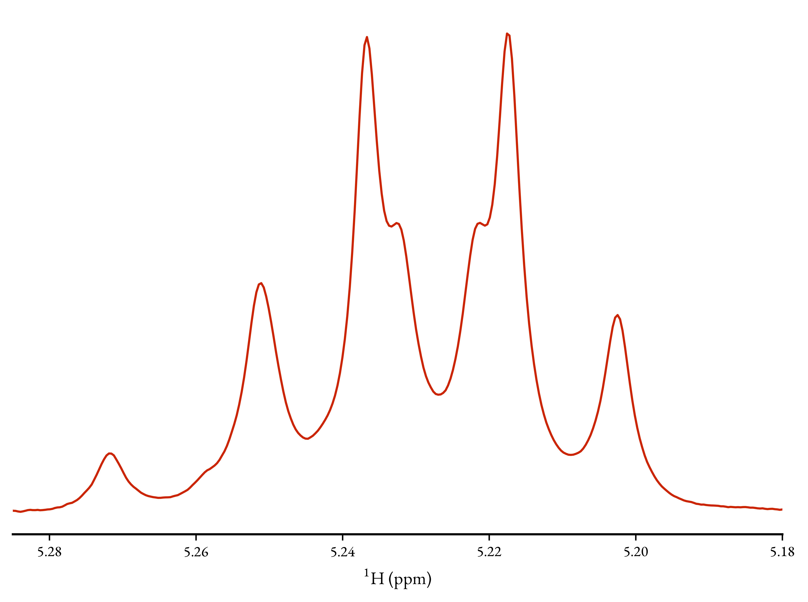

Example Walkthrough
===================

.. todo::
   To be re-written to reflect recent changes

As an illustration of the typical steps involved in using NMR-EsPy, we will
consider an example dataset that ships with TopSpin 4. Assuming you installed
TopSpin in the default path, this should be present in the path:

* Linux ``/opt/topspin4.x.y/examdata/exam1d_1H/1/pdata/1``
* Windows: ``C:\Bruker\TopSpin4.x.y\examdata\exam1d_1H\1\pdata\1``

In what follows, as I am using TopSpin 4.0.8, I shall be replacing
``topspin4.x.y`` with ``topspin4.0.8``.

I reccommend that you follow this walkthrough using a Python
interpreter to ensure everything runs smoothly on your system.

Generating an NMR-EsPy instance
^^^^^^^^^^^^^^^^^^^^^^^^^^^^^^^

To get started, it is necessary to import the ``nmrespy.load`` module: ::

   >>> import nmrespy.load as load

For this example, the data I will be importing is processed data, rather than
raw FID data. In order to create an NMR-EsPy instance from a processed data
directory, :py:func:`~nmrespy.load.import_bruker_pdata` needs to be used.
This functions creates an instance of :py:class:`~nmrespy.core.NMREsPyBruker`,
which I will save to the variable ``info``: ::

   >>> path = '/opt/topspin4.0.8/examdata/exam1d_1H/1/pdata/1'
   >>> info = load.import_bruker_pdata(path)
   >>> type(info)
   <class 'nmrespy.core.NMREsPyBruker'>
   >>> print(info)

   <NMREsPyBruker object at 0x7feff35b4f28>

   ───Basic Info───
   Type:                  processed data
   Dimension:             1
   Data:                  1r, numpy.ndarray of shape (32768,)
                          1i, numpy.ndarray of shape (32768,)
   Directory:             /opt/topspin4.0.8/examdata/exam1d_1H/1/pdata/1
   Sweep width:           5494.5055Hz (10.9861ppm) (F1)
   Transmitter offset:    2249.2060Hz (4.4972ppm) (F1)
   Basic frequency:       500.1300MHz (F1)
   Transmitter frequency: 500.1322MHz (F1)
   Nuclei:                1H (F1)

Frequency Filtration
^^^^^^^^^^^^^^^^^^^^

In this example, I am going to focus on the spectral region between
5.285-5.180ppm. The region looks like this:

To generate a frequency-filtered, time-domian signal from
the processed data, the
:py:meth:`~nmrespy.core.NMREsPyBruker.frequency_filter` method is used. It is
also necessary to specify a region that appears to be just noise. In this
example, I will set this region to be 9.5-9.2ppm. ::

   >>> info.frequency_filter(region=(5.285, 5.180), noise_region=(9.5, 9.2,))
   >>> print(info)

   <NMREsPyBruker object at 0x7feff35b4f28>

   ...

   ───Frequency Filter Info───
   Virtual Echo:      numpy.ndarray of shape (32768,)
   Half Echo:         numpy.ndarray of shape (16384,)
   Filtered Spectrum: numpy.ndarray of shape (32768,)
   Region:            2643.2517 - 2590.7681Hz (5.2851 - 5.1802ppm) (F1)

Notice that printing the class instance again
has resulted in a section called `Frequency Filter Info`. This provides
information on the frequency filtered data generated. Note that the signal
that will actually be analysed is contained in the ``info.half_echo``
attribute.

Estimating the Signal Parameters
^^^^^^^^^^^^^^^^^^^^^^^^^^^^^^^^

Matrix Pencil Method
--------------------

Now that I have generated the frequency filtered signal, I can begin the
estimation routine. Before estimating the signal parameters using Nonlinear
Prgramming (NLP), an initial guess of the parameters is required. We derive
this guess using :py:meth:`~nmrespy.core.NMREsPyBruker.matrix_pencil`: ::

   >>> info.matrix_pencil(trim=(8192,))
   =============
   ITMPM started
   =============
   Pencil parameter: 2730

   Hankel data matrix constructed.
	   Size:   5462 x 2731
	   Memory: 0.2223GiB

   Performing Singular Value Decomposition...
   Time taken: 17.939s

   Estimating number of oscillations using MDL...
   Number of oscillations: 11

   Determining signal poles...
   Time taken: 17.417s

   Determining complex amplitudes...
   Time taken: 0.22s

   ==============
   ITMPM complete
   ==============
   Time taken: 35.528s

   >>> print(info)

   <NMREsPyBruker object at 0x7feff35b4f28>

  ...

   ───Matrix Pencil Info───
   Result (theta0): numpy.ndarray with shape (11, 4)

Notice under `Matrix Pencil Info` that a parameter estimate, called
``info.theta0`` has been generated, containing 11 oscillators. The data
was sliced using the ``trim`` argument, so that only the initial 8k
points were used in the analysis. This was done primarily for time-saving
purposes. It is also useful to use this when you have insufficient RAM to
perform the method on the full signal.

.. todo::

   Section on Memory useage and timings

Nonlinear Programming
---------------------

An initial guess (``info.theta0``) is  now subjected to the NLP routine
using the :py:meth:`~nmrespy.core.NMREsPyBruker.nonlinear_programming`
method. As I derived the frequency-filtered data from well-phased spectral
data, I will set the ``phase_variance`` argument to ``True``, to make the
optimisation routine ensures that the estimate's oscillator phases are
similar to each other (and hopefully very close to 0). ::

   >>> info.nonlinear_programming(phase_variance=True)
   =============================
   Nonlinear Programming Started
   =============================
   | niter |f evals|CG iter|  obj func   |tr radius |   opt    |  c viol  | penalty  |CG stop|
   |-------|-------|-------|-------------|----------|----------|----------|----------|-------|
   |   1   |   1   |   0   | +6.0848e-01 | 1.00e+00 | 3.02e-01 | 0.00e+00 | 1.00e+00 |   0   |
   |   2   |   2   |   1   | +2.3348e-01 | 7.00e+00 | 1.05e+00 | 0.00e+00 | 1.00e+00 |   2   |
   |   3   |   3   |  12   | +6.2406e-03 | 1.09e+01 | 5.57e-01 | 0.00e+00 | 1.00e+00 |   4   |

   ...

   |  99   |  99   | 1607  | +7.3590e-04 | 1.09e+01 | 3.08e-05 | 0.00e+00 | 1.00e+00 |   4   |
   |  100  |  100  | 1651  | +7.3340e-04 | 1.09e+01 | 1.91e-02 | 0.00e+00 | 1.00e+00 |   1   |

   The maximum number of function evaluations is exceeded.
   Number of iterations: 100, function evaluations: 100, CG iterations: 1651,
   optimality: 1.91e-02, constraint violation: 0.00e+00, execution time: 1.9e+01 s.

   Negative amplitudes detected! These have been removed
   Updated no. of oscillators: 9
   | niter |f evals|CG iter|  obj func   |tr radius |   opt    |  c viol  | penalty  |CG stop|
   |-------|-------|-------|-------------|----------|----------|----------|----------|-------|
   |   1   |   1   |   0   | +8.8826e-04 | 1.00e+00 | 5.79e-02 | 0.00e+00 | 1.00e+00 |   0   |
   |   2   |   2   |   2   | +8.8459e-04 | 1.00e+00 | 4.17e-03 | 0.00e+00 | 1.00e+00 |   4   |
   |   3   |   3   |   4   | +8.8457e-04 | 1.00e+00 | 9.27e-04 | 0.00e+00 | 1.00e+00 |   4   |

   ...

   |  99   |  99   | 1799  | +8.7294e-04 | 1.04e+00 | 3.60e-06 | 0.00e+00 | 1.00e+00 |   4   |
   |  100  |  100  | 1835  | +8.7294e-04 | 1.04e+00 | 5.48e-05 | 0.00e+00 | 1.00e+00 |   1   |

   The maximum number of function evaluations is exceeded.
   Number of iterations: 100, function evaluations: 100, CG iterations: 1835,
   optimality: 5.48e-05, constraint violation: 0.00e+00, execution time: 1.5e+01 s.

   ==============================
   Nonlinear Programming Complete
   ==============================
   Time taken: 34.329s

   >>> print(info)

   <NMREsPyBruker object at 0x7feff35b4f28>

  ...

  ───Nonlinear Programming Info───
  Result (theta): numpy.ndarray with shape (9, 4)

The final estimate, called ``info.theta``, contains 9 oscillators.

Saving Results
^^^^^^^^^^^^^^

Pickling NMR-EsPy Instances
---------------------------

``info`` can be serialised, and saved to a binary file using Python's
`pickle <https://docs.python.org/3/library/pickle.html>`_ module: ::

   >>> info.pickle_save(fname='example.pkl')
   Saved instance of NMREsPyBruker to ./example.pkl

This can be recovered using :py:func:`~nmrespy.load.pickle_load` if you
wish to work with it again: ::

  >>> info_copy = load.pickle_load('example.pkl')
  Loaded contents of ./example.pkl
  >>> info == info_copy
  True

.. warning::
   `From the Python docs:`

   "The pickle module is not secure. Only unpickle data you trust.
   It is possible to construct malicious pickle data which will execute
   arbitrary code during unpickling. Never unpickle data that could have
   come from an untrusted source, or that could have been tampered with."

   You should only use :py:func:`~nmrespy.load.pickle_load` on files that
   you are 100% certain were generated using
   :py:meth:`~nmrespy.core.NMREsPyBruker.pickle_save`. If you use
   :py:func:`~nmrespy.load.pickle_load` on a .pkl file, and the resulting
   output is not an instance of :py:class:`~nmrespy.core.NMREsPyBruker`,
   you will be warned.

Writing Results to a Text File/PDF
----------------------------------

The result can be written to a text file and/or a PDF, using the
:py:meth:`~nmrespy.core.NMREsPyBruker.write_result` method. You may add
a note to describe the result using the ``descrip`` argument. ::

   >>> msg = 'Example estimation result for NMR-EsPy docs.'
   >>> info.write_result(descrip=msg, fname='example.txt', format='txt')
   Saved result to ./example.txt
   >>> info.write_result(descrip=msg, fname='example.pdf', format='pdf')
   Result successfuly saved to ./example.pdf
   If you wish to customise the document, the TeX file can be found at:
   ./example.tex

.. note::

   In order to generate PDF files, you will need a LaTeX installation on
   your system. See the method's documentation for details.

Generating Result Figures
-------------------------

Finally, to generate a figure of the result, use the
:py:meth:`~nmrespy.core.NMREsPyBruker.plot_result` method, which is
esssentially a wrapper around `matplotlib <https://matplotlib.org/>`_. There
is wide scope for customising the plot, which is described in detail in the
method's documentation. To simply generate the default plot style, do not
add any arguments::

   >>> fig, ax, lines, labels = info.plot_result()
   >>> fig.savefig('example_plot.pdf', format='pdf')

Here are the resulting files:

* :download:`example.txt <_static/example.txt>`
* :download:`example.tex <_static/example.tex>`
* :download:`example.pdf <_static/example.pdf>`
* :download:`example_plot.pdf <_static/example_plot.pdf>`

Summary
^^^^^^^

A full script for achieving everything covered in this tutorial is given below.
In this example, some customistation of the plot has been done, including:

* Making the plot of the original data black (#000000), instead of the
  default grey (#808080), by setting ``datacol='k'`` in
  :py:meth:`~nmrespy.core.NMREsPyBruker.plot_result`.
* Colouring the oscillator plots using matplotib's `winter` colormap, by
  setting ``osccols='winter'``
  in :py:meth:`~nmrespy.core.NMREsPyBruker.plot_result` (see
  https://matplotlib.org/3.1.0/tutorials/colors/colormaps.html).
* Manually tweaking the locations of some of the oscillator labels to improve
  clarity.

.. code-block:: python
   :linenos:

   #!/usr/bin/python3
   import nmrespy.load as load

   # import data
   path = '/opt/topspin4.0.8/examdata/exam1d_1H/1/pdata/1'
   info = load.import_bruker_pdata(path)

   # construct frequency-filtered time-domain signal
   info.frequency_filter(region=(5.285, 5.180), noise_region=(9.5, 9.2))

   # estimate parameters with 1) MPM, and then 2) NLP
   info.matrix_pencil(trim=(8192,))
   info.nonlinear_programming(phase_variance=True)

   # save instance using pickle
   info.pickle_save(fname='example.pkl')

   # write to textfile and pdf
   # N.B. The appropriate file extension is added automatically if not given
   msg = 'Example estimation result for NMR-EsPy docs.'
   info.write_result(descrip=msg, fname='example') # textfile is default
   info.write_result(descrip=msg, fname='example', format='pdf')

   # construct figure of result
   fig, ax, lines, labs = info.plot_result(datacol='k',
                                           osccols='winter')

   # tweak locations of oscillator labels for aesthetic improvement
   labs['osc1'].set_x(5.2013)
   labs['osc2'].set_x(5.216)
   labs['osc5'].set_x(5.2393)
   labs['osc7'].set_x(5.2497)
   labs['osc9'].set_x(5.2705)

   # save figure
   fig.savefig('example_plot_custom.pdf', format='pdf')

This changes the plot appearence as follows:
:download:`example_plot_custom.pdf <_static/example_plot_custom.pdf>`
