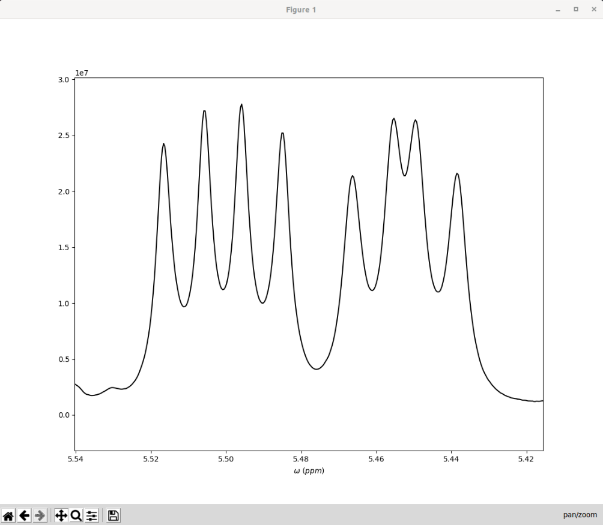

Example Walkthrough
===================

As an illustration of the typical steps involved in using NMR-EsPy, we will
consider an example dataset that ships with TopSpin 4. Assuming you installed
TopSpin in the default path, this should be present in the path:

* Linux: ``/opt/topspin4.x.y/examdata/exam1d_1H/1/pdata/1``
* Windows: ``C:\Bruker\TopSpin4.x.y\examdata\exam1d_1H\1\pdata\1``

In what follows, as I am using TopSpin 4.0.8, I shall be replacing
``topspin4.x.y`` with ``topspin4.0.8``.

I recommend that you follow this walkthrough using a Python
interpreter to ensure everything runs smoothly on your system.

Generating an NMR-EsPy instance
^^^^^^^^^^^^^^^^^^^^^^^^^^^^^^^

To get started, it is necessary to import the :py:class:`nmrespy.core.Estimator`
class. A new instance of this class is initialised using the static
:py:meth:`~nmrespy.core.Estimator.new_bruker` method:

.. code:: python3

   >>> from nmrespy.core import Estimator
   >>> # Specify the path to the directory containing 1r
   >>> path = "/opt/topspin4.0.8/examdata/exam1d_1H/1/pdata/1"
   >>> estimator = Estimator.new_bruker(path)
   >>> type(estimator)
   <class 'nmrespy.core.Estimator'>

Information about the estimator can be seen by printing it:

.. code:: python3

   >>> print(estimator)
   <nmrespy.core.Estimator at 0x7f702558ba90>
   source : bruker_pdata
   data : [ 8237241.76470947      +0.j          1834272.48552552-9941412.67849912j
   -7908307.89165751+1371281.69800517j ...
          0.              +0.j                0.              +0.j
          0.              +0.j        ]
   dim : 1
   n : [32768]
   path : tests/data/1/pdata/1
   sw : [5494.50549450549]
   offset : [2249.20599998768]
   sfo : [500.132249206]
   nuc : ['1H']
   fmt : <i4
   filter_info : None
   result : None
   errors : None
   _manual_edit : False
   _converter : <nmrespy._misc.FrequencyConverter object at 0x7f702558bd30>
   _logpath : /home/simon/Documents/DPhil/projects/spectral_estimation/
   NMR-EsPy/nmrespy/logs/210301120209.log

An interactive plot of the data, in the frequency domain, can be seen using the
:py:meth:`~nmrespy.core.Estimator.view_data` method:

.. code:: python3

   >>> estimator.view_data()

.. image:: images_etc/walkthrough/figures/view_data.png
   :align: center

Frequency Filtration
^^^^^^^^^^^^^^^^^^^^

For complex NMR signals, it is typically necessary to consider a subset of
the frequency space at any time, otherwise the computational burden would be
too large. To overcome this, it is possible to derive a time-domain signal
which has been generated via frequency-filtration.

In this example, I am going to focus on the spectral region between
5.54-5.42ppm. The region looks like this:

To generate a frequency-filtered signal from the imported data, the
:py:meth:`~nmrespy.core.Estimator.frequency_filter` method is used. It is
also necessary to specify a region that appears to contain no signals (this
is used to gain an insight into the data's noise variance). In this
example, I will set this region to be -0.15 to -0.3ppm.

.. code:: python3

   >>> estimator.frequency_filter([[5.54, 5.42]], [[-0.15, -0.3]])

Estimating the Signal Parameters
^^^^^^^^^^^^^^^^^^^^^^^^^^^^^^^^

Matrix Pencil Method
--------------------

Now that a frequency filtered signal has been generated, we can begin the
estimation routine. Before estimating the signal parameters using nonlinear
programming (NLP), an initial guess of the parameters is required. We can derive
this guess using :py:meth:`~nmrespy.core.Estimator.matrix_pencil`:

.. code:: python3

   >>> estimator.matrix_pencil()
   ============================
   MATRIX PENCIL METHOD STARTED
   ============================
   --> Pencil Parameter: 358
   --> Hankel data matrix constructed:
   Size:   718 x 359
   Memory: 3.9331MiB
   --> Performing Singular Value Decomposition...
   --> Determining number of oscillators...
       Number of oscillators will be estimated using MDL
       Number of oscillations: 12
   --> Determining signal poles...
   --> Determining complex amplitudes...
   --> Checking for oscillators with negative damping...
       None found
    =============================
    MATRIX PENCIL METHOD COMPLETE
    =============================
    Time elapsed: 0 mins, 0 secs, 388 msecs

The result of the estimation is stored within the ``result`` attribute,
which can be accessed using :py:meth:`~nmrespy.core.Estimator.get_result`.

Nonlinear Programming
---------------------

The ``result`` attribute is next subjected to a NLP routine using the
:py:meth:`~nmrespy.core.Estimator.nonlinear_programming` method. As the
frequency-filtered data was derived from well-phased spectral
data, the optional ``phase_variance`` argument is set to ``True``. The
optimisation routine will then ensure that the estimate's phases are similar to
each other (and hopefully very close to 0), and will often remove excessive
oscillators from the Matrix Pencil result (note that our initial guess in
this example contains 12 oscillators).

.. code:: python3

   >>> estimator.nonlinear_programming(phase_variance=True)
   =============================
   NONLINEAR PROGRAMMING STARTED
   =============================
   | niter |f evals|CG iter|  obj func   |tr radius |   opt    |  c viol  | penalty  |CG stop|
   |-------|-------|-------|-------------|----------|----------|----------|----------|-------|
   |   1   |   1   |   0   | +1.6124e-01 | 1.00e+00 | 9.28e-02 | 0.00e+00 | 1.00e+00 |   0   |
   |   2   |   2   |   1   | +8.9788e-02 | 7.00e+00 | 6.96e-01 | 0.00e+00 | 1.00e+00 |   2   |
   |   3   |   3   |   9   | +8.9788e-02 | 7.00e-01 | 6.96e-01 | 0.00e+00 | 1.00e+00 |   3   |

   --snip--

   |  100  |  100  |  939  | +6.2710e-04 | 8.61e-03 | 3.17e-04 | 0.00e+00 | 1.00e+00 |   4   |

   --snip--

   Negative amplitudes detected. These oscillators will be removed
   Updated number of oscillators: 9
   | niter |f evals|CG iter|  obj func   |tr radius |   opt    |  c viol  | penalty  |CG stop|
   |-------|-------|-------|-------------|----------|----------|----------|----------|-------|
   |   1   |   1   |   0   | +1.5728e-03 | 1.00e+00 | 1.55e-01 | 0.00e+00 | 1.00e+00 |   0   |

   --snip--

   |  100  |  100  | 2170  | +8.6101e-04 | 5.38e+00 | 3.41e-06 | 0.00e+00 | 1.00e+00 |   4   |

   --snip--
   
   ==============================
   NONLINEAR PROGRAMMING COMPLETE
   ==============================
   Time elapsed: 0 mins, 3 secs, 676 msecs

The ``result`` attribute has now been updated with the result obtained using
NLP.

Saving Results
^^^^^^^^^^^^^^

Writing Results to a Text File/PDF/CSV
--------------------------------------

The estimation result can be written to ``.txt``, ``.pdf`` and ``.csv``
formats, using the :py:meth:`~nmrespy.core.Estimator.write_result` method.

.. code:: python3

  >>> msg = "Example estimation result for NMR-EsPy docs."
  >>> for fmt in ["txt", "pdf", "csv"]:
  ...     estimator.write_result(path="example", description=msg, fmt=fmt)
  ...
  Saved result to /home/path/to/.../example.txt
  Result successfully output to:
  /home/path/to/.../example.pdf
  If you wish to customise the document, the TeX file can be found at:
  /home/path/to/.../example.tex
  Saved result to /home/path/to/.../example.csv

The files generated are as follows:

* :download:`example.txt <images_etc/walkthrough/example.txt>`
* :download:`example.tex <images_etc/walkthrough/example.tex>`
* :download:`example.pdf <images_etc/walkthrough/example.pdf>`
* :download:`example.csv <images_etc/walkthrough/example.csv>`

.. note::

   In order to generate PDF files, you will need a LaTeX installation on
   your system. See the documentation for the
   :py:func:`nmrespy.write.write_result` function for more details.

Generating Result Figures
-------------------------

To generate a figure of the result, you can use the
:py:meth:`~nmrespy.core.Estimator.plot_result` method, which utilises
`matplotlib <https://matplotlib.org/>`_. There is wide scope for customising
the plot, which is described in detail in the documentation of
:py:func:`nmrespy.plot.plot_result`. See `Summary`_ for an example of some
basic plot customisation.

.. code:: python3

   >>> plot = info.plot_result()
   >>> plot.fig.savefig("plot_example.png")

* :download:`example_plot.png <images_etc/walkthrough/figures/plot_example.png>`

Pickling Estimator Instances
----------------------------

The estimator instance can be serialised, and saved to a binary file using
Python's `pickle <https://docs.python.org/3/library/pickle.html>`_ module,
with :py:meth:`~nmrespy.core.Estimator.to_pickle`:

.. code::

   >>> estimator.to_pickle(path="pickle_example")
   Saved instance of Estimator to /home/path/to/.../pickle_example.pkl

The estimator can subsequently be recovered using
:py:meth:`~nmrespy.core.Estimator.from_pickle`:

.. code:: python3

   >>> estimator_cp = Estimator.from_pickle(path="pickle_example")
   >>> type(estimator_cp)
   <class 'nmrespy.core.Estimator'>

Saving a Logfile
----------------

A summary of the methods applied to the estimator can be saved using the
:py:meth:`~nmrespy.core.Estimator.save_logfile` method:

.. code:: python3

   >>> estimator.save_logfile(path="logfile_example")
   Log file successfully saved to /home/path/to/.../logfile_example.log

* :download:`logfile_example.log <images_etc/walkthrough/logfile_example.log>`

Summary
^^^^^^^

A script which performs the entire procedure described above is as follows.
Note that further customisation has been applied to the plot to give it an
aesthetic upgrade.

.. code:: python3

   from nmrespy.core import Estimator

   # Path to data. You'll need to change the 4.0.8 bit if you are using a
   # different TopSpin version.

   # --- Linux users ---
   path = "/opt/topspin4.0.8/examdata/exam1d_1H/1/pdata/1"

   # --- Windows users ---
   # path = "C:/Bruker/TopSpin4.0.8/examdata/exam1d_1H/1/pdata/1"

   estimator = Estimator.new_bruker(path)
   estimator.frequency_filter([[5.54, 5.42]], [[-0.15, -0.3]])
   estimator.matrix_pencil()
   estimator.nonlinear_programming(phase_variance=True)

   msg = "Example estimation result for NMR-EsPy docs."
   for fmt in ["txt", "pdf", "csv"]:
       estimator.write_result(path="example", description=msg, fmt=fmt)

   # Plot result. Set oscillator colours using the viridis colourmap
   plot = estimator.plot_result(oscillator_colors='viridis')

   # Shift oscillator labels
   label_shifts = [
       (-0.001, 2E5),
       (0.0, 2E5),
       (0.001, 2E5),
       (0.001, 2E5),
       (-0.0015, 2E5),
       (-0.001, 2E5),
       (0.0025, 2E5),
       (0.0025, 2E5),
       (-0.001, 2E5),
   ]

   for i, shifts in enumerate(label_shifts, start=1):
        plot.labels[i].set_position(
           tuple(p + s for p, s in zip(plot.labels[i].get_position(), shifts))
        )

   plot.fig.savefig("plot_example_edited.png")
   estimator.to_pickle(path="pickle_example")
   estimator.save_logfile(path="logfile_example")

* :download:`nmrespy_example.py <images_etc/walkthrough/nmrespy_example.py>`
* :download:`plot_example_edited.png <images_etc/walkthrough/figures/plot_example_edited.png>`

More functionality is provided by the :py:class:`~nmrespy.core.Estimator`.
Look at the docs for details., or email me (I don't usually bite):
`simon.hulse@chem.ox.ac.uk <mailto:simon.hulse@chem.ox.ac.uk>`_
