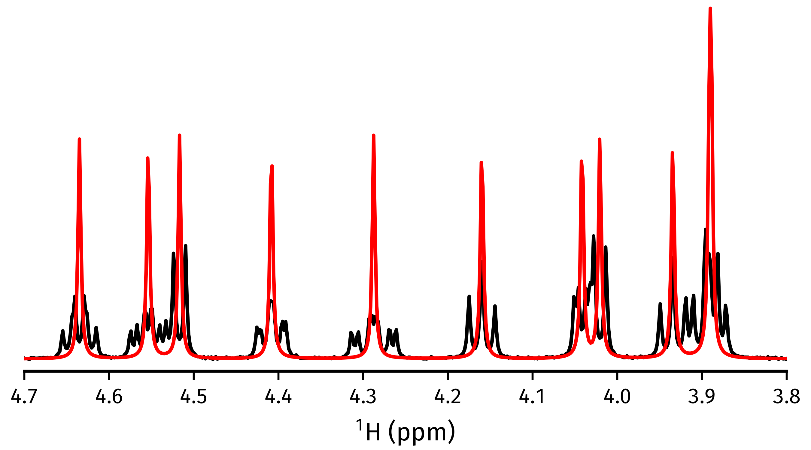

.. _ESTIMATOR2DJ:

Using ``Estimator2DJ``
======================

The :py:class:`nmrespy.Estimator2DJ` class enables the estimation of 2D J-Resolved
(2DJ) spectroscopy datasets. This facilitates use of **CUPID**
(**C**\ omputer-assisted **U**\ ndiminished-sensitivity **P**\ rotocol for **I**\ deal
**D**\ ecoupling) which can be used to generate homodecoupled (*pure shift*)
spectra and to predict multiplet structures.

Many methods in this class have analogues in :py:class:`~nmrespy.Estimator1D`.
You are advised to read through the :ref:`1D tutorial <ESTIMATOR1D>` before
continuing, as minimal descriptions will be provided of concepts covered in that.

Generating an instance
----------------------

Bruker data
^^^^^^^^^^^

Use :py:meth:`~nmrespy.Estimator2DJ.new_bruker`. Unlike ``Estimator1D``, you
must import time-domain 2DJ data. The path should be set as
``"<path_to_data>/<expno>/"``. There should be a ``ser`` file, an ``acqus``
file, and an ``acqu2s`` file directly under this directory. Phasing in the
direct-dimension will be needed. If deemed necessary, baseline correction can
be performed too.

.. code:: pycon

    >>> import nmrespy as ne
    >>> estimator = ne.Estimator2DJ.new_bruker("/home/simon/nmr_data/qunine/dexamethasone/2")
    >>> estimator.phase_data(p0=0.041, p1=-6.383, pivot=1923)
    >>> estimator.baseline_correction()
    <Estimator2DJ object at 0x7f4b7e1f5cd0>

    Experiment Information
    ──────────────────────

    Parameter                   │F1  │F2
    ────────────────────────────┼────┼───────
    Nucleus                     │N/A │¹H
    Transmitter Frequency (MHz) │N/A │600.18
    Sweep Width (Hz)            │50  │7211.5
    Sweep Width (ppm)           │N/A │12.016
    Transmitter Offset (Hz)     │0   │2815.4
    Transmitter Offset (ppm)    │N/A │4.691

    No estimation performed yet.

Simulated data from Spinach
^^^^^^^^^^^^^^^^^^^^^^^^^^^

Use :py:meth:`~nmrespy.Estimator2DJ.new_spinach`

.. code:: pycon

    >>> # Sucrose DFT calculation shifts and couplings
    >>> # Note that the dataset generated will not be reminiscent of what
    >>> # the actual solution-state dataset for sucrose looks like!
    >>> shifts = [
    ...     6.005, 3.510, 3.934, 3.423, 4.554, 3.891, 4.287, 3.332, 1.908, 1.555, 0.644,
    ...     4.042, 4.517, 3.889, 4.635, 4.160, 4.021, 4.408, 0.311, 1.334, 0.893, 0.150,
    ... ]
    >>> couplings = [
    ...     (1, 2, 2.285), (2, 3, 4.657), (2, 8, 4.828), (3, 4, 4.326),
    ...     (4, 5, 4.851), (5, 6, 5.440), (5, 7, 2.288), (6, 7, -6.210),
    ...     (7, 11, 7.256), (12, 13, -4.005), (12, 19, 1.460), (14, 15, 4.253),
    ...     (15, 16, 4.448), (15, 21, 3.221), (16, 18, 4.733), (17, 18, -4.182),
    ...     (18, 22, 1.350),
    ... ]
    >>> estimator = ne.Estimator2DJ.new_spinach(
    ...     shifts=shifts,
    ...     couplings=couplings,
    ...     pts=(64, 4096),
    ...     sw=(30., 2200.),
    ...     offset=1000.,
    ...     field=300.,
    ...     field_unit="MHz",
    ...     snr=20.,
    ... )

.. note::

    We will be using the estimator generated above for the rest of this
    tutorial. If you do not have access to MATLAB/Spinach, you can construct the
    estimator by using an FID I made earlier:

    .. code::

        >>> import nmrespy as ne
        >>> from pathlib import Path
        >>> import pickle
        >>> estimator_path = Path(ne.__file__).expanduser().parents[1] \
        ...     / "samples/jres_sucrose_sythetic/sucrose_jres_synthetic.pkl"
        >>> with open(fid_path, "rb") as fh:
        ...     estimator = pickle.load(fh)
        ...

Estimating the dataset
----------------------

The procedure for estimating 2DJ data is very similar to that of 1D data. You
need to specify regions in the direct dimension that are of interest for
generating filtered sub-FIDs. No filtering is done in the indirect dimension.
In our example, it turns out that for a couple of the regions selected, the number
of oscillators automatically predicted is slightly smaller that the "true" number,
and so the true number has been hard-coded (see the lines involving
``initial_guesses``).

.. code::

    >>> regions = (
    ...     (6.08, 5.91), (4.72, 4.46), (4.46, 4.22), (4.22, 4.1), (4.09, 3.98),
    ...     (3.98, 3.83), (3.58, 3.28), (2.08, 1.16), (1.05, 0.0),
    ... )
    >>> n_regions = len(regions)
    >>> initial_guesses = n_regions * [None]
    >>> initial_guesses[1:3] = [16, 16]
    >>> # kwargs common to estimation of each region
    >>> common_kwargs = {
    ...     "noise_region": (5.5, 5.33),
    ...     "region_unit": "ppm",
    ...     "max_iterations": 200,
    ...     "phase_variance": True,
    ... }
    >>> for init_guess, region in zip(initial_guesses, regions):
    ...     kwargs = {**{"region": region, "initial_guess": init_guess}, **common_kwargs}
    ...     estimator.estimate(**kwargs)
    >>> # It is a good idea to pickle the estimator after estimation
    >>> estimator.to_pickle("sucrose")

Acquiring a pure shift spectrum
----------------------------------

The :py:meth:`~nmrespy.Estimator2DJ.cupid_spectrum` method produces a
pure shift spectrum using the 2DJ parameter estimate. In the code snippet
below, a figure is made which compares the pure shift spectrum with the spectrum
of the first direct-dimension slice in the 2DJ data, i.e. a normal 1D
spectrum.

.. code::

    >>> # Normal 1D spectrum
    >>> init_spectrum = estimator.spectrum_direct.real
    >>> # Homodecoupled spectrum produced using CUPID
    >>> cupid_spectrum = estimator.cupid_spectrum().real
    >>> # Get direct-dimension shifts
    >>> shifts = estimator.get_shifts(unit="ppm", meshgrid=False)[-1]
    >>> import matplotlib.pyplot as plt
    >>> fig, ax = plt.subplots(figsize=(4.5, 2.5))
    >>> ax.plot(shifts, init_spectrum, color="k")
    >>> ax.plot(shifts, cupid_spectrum, color="r")
    >>> # The most interesting region of the spectrum
    >>> ax.set_xlim(4.7, 3.8)
    >>> # ========================
    >>> # These lines are just for plot aesthetics
    >>> for x in ("top", "left", "right"):
    >>>     ax.spines[x].set_visible(False)
    >>> ax.set_xticks([4.7 - 0.1 * i for i in range(10)])
    >>> ax.set_yticks([])
    >>> ax.set_position([0.03, 0.175, 0.94, 0.83])
    >>> ax.set_xlabel(f"{estimator.unicode_nuclei[1]} (ppm)")
    >>> # ========================
    >>> fig.savefig("cupid_spectrum.png")

Multiplet prediction
--------------------

Oscillators belonging to the same multiplet can be predicted based on the fact
that in a 2DJ FID any pair of signals :math:`i, j` should satisfy the following:

.. math::

    \left \lvert \left( f^{(2)}_i - f^{(1)}_i \right) - \left(f^{(2)}_j -
    f^{(1)}_j \right) \right \rvert  < \epsilon,

where :math:`\epsilon` is an error threshold, and :math:`f^{(1)}` and
:math:`f^{(2)}` are the estimated indirect- and direct-dimension frequencies,
respectively. :py:meth:`~nmrespy.Estimator2DJ.predict_multiplets` generates
groups of oscillator indices satisfying the above criterion. A key parameter
for this is ``thold``, which sets the error threshold :math:`\epsilon`. By
default, this is set to be
:math:`\operatorname{min}\left(
f^{(1)}_{\text{sw}} / N^{(1)},
f^{(2)}_{\text{sw}} / N^{(2)}\right)`, i.e whichever is larger out of
the indirect- and direct-dimension spectral resolutions. However, especially
when considering real data, this threshold can be a little optimistic. For good
multiplet groupings, you may need to manually provide a larger threshold.

In the example below, multiplet groups are determined for regions with indices
1-5 (covering the region plotted above).

.. code:: pycon

    >>> indices = [1, 2, 3, 4, 5]
    >>> multiplets = estimator.predict_multiplets(indices=indices)
    >>> for (freq, idx) in multiplets.items():
    ...     print(f"{freq / estimator.sfo[1]:.4f}ppm: {idx}")
    ...
    3.8890ppm: [1, 4]
    3.8910ppm: [0, 2, 3, 5]
    3.9344ppm: [6, 7, 8]
    4.0205ppm: [9, 10]
    4.0416ppm: [11, 12, 13, 14]
    4.1598ppm: [15, 16, 17]
    4.2876ppm: [18, 19, 20, 21, 22, 23, 24, 25]
    4.4083ppm: [26, 27, 28, 29, 30, 31, 32, 33]
    4.5167ppm: [34, 35]
    4.5537ppm: [36, 37, 38, 39, 40, 41, 42, 43]
    4.6349ppm: [44, 45, 46, 47, 48, 49]

To generate FIDs corresponding to each multiplet structure, use the
:py:meth:`~nmrespy.Estimator2DJ.construct_multiplet_fids` method. In the following
code snippet, each generated FID undergoes FT, with all the spectra being
plotted.

.. code:: pycon

    >>> # Direct-dimension shifts
    >>> shifts_f2 = estimator.get_shifts(unit="ppm", meshgrid=False)[-1]
    >>> fids = estimator.construct_multiplet_fids(indices=indices)
    >>> # Create an iterator which cycles through values infinitely
    >>> from itertools import cycle
    >>> colors = cycle(["#84c757", "#ef476f", "#ffd166", "#36c9c6"])
    >>> fig, ax = plt.subplots(figsize=(4.5, 2.5))
    >>> for fid in fids:
    ...     # Halve first point prior to FT to prevent vertical baseline shift
    ...     fid[0] *= 0.5
    ...     # FT and retrieve real component
    ...     spectrum = ne.sig.ft(fid).real
    ...     ax.plot(shifts_f2, spectrum, color=next(colors))
    ...
    >>> ax.set_xlim(4.7, 3.8)
    >>> # ========================
    >>> # These lines are just for plot aesthetics
    >>> for x in ("top", "left", "right"):
    ...     ax.spines[x].set_visible(False)
    ...
    >>> ax.set_xticks([4.7 - 0.1 * i for i in range(10)])
    >>> ax.set_yticks([])
    >>> ax.set_position([0.03, 0.175, 0.94, 0.83])
    >>> ax.set_xlabel(f"{estimator.unicode_nuclei[1]} (ppm)")
    >>> # ========================
    >>> fig.savefig("multiplets.png")

.. image:: ../media/multiplets.png
   :align: center

Generating tilted spectra
-------------------------

The well-known 45° shear (commonly called a tilt) that is applied to 2DJ spectra
for orthogonal separation of chemical shifts and scalar couplings effectively maps the
frequencies in the direct dimension :math:`f^{(2)}` to :math:`f^{(2)} -
f^{(1)}`. Armed with a parameter estimate of an FID, a synthetic signal with
these adjusted frequencies can be constructed. As well as this, generating a pair of
phase- or amplitude-modulated FIDs enables the construction of absorption-mode
spectra (cf the issues involved in generating nice spectra from hypercomplex
2DJ datasets). Use :py:meth:`nmrespy.Estimator2DJ.sheared_signal`, with
``indirect_modulation`` set to either ``"amp"`` or ``"phase"`` to generate the
desired spectrum. Then, use either
:py:func:`nmrespy.sig.proc_phase_modulated` or
:py:func:`nmrespy.sig.proc_amp_modulated` as appropriate to construct the
spectrum:

.. code::

    >>> # Generate P- and N- type FIDs with "sheared" frequencies
    >>> sheared_fid = estimator.sheared_signal(indirect_modulation="phase")
    >>> # sheared_fid[0] -> P-type, sheared_fid[1] -> N-type
    >>> sheared_fid.shape
    (2, 64, 4096)
    >>> # Generates 2rr, 2ri, 2ir, 2ii spectra
    >>> sheared_spectrum = ne.sig.proc_phase_modulated(sheared_fid)
    >>> sheared_spectrum.shape
    (4, 64, 4096)
    >>> spectrum_2rr = sheared_spectrum[0]
    >>> # Note the `meshgrid` kwarg is True here to make 2D shift arrays
    >>> shifts_f1, shifts_f2 = estimator.get_shifts(unit="ppm")
    >>> fig, ax = plt.subplots(figsize=(4.5, 2.5))
    >>> # Contour levels
    >>> base, factor, nlevels = 25, 1.3, 10
    >>> levels = [base * factor ** i for i in range(nlevels)]
    >>> ax.contour(
    ...     shifts_f2,
    ...     shifts_f1,
    ...     spectrum_2rr,
    ...     colors="k",
    ...     levels=levels,
    ...     linewidths=0.3,
    ... )
    >>> ax.set_xlim(4.7, 3.8)
    >>> ax.set_ylim(10., -10.)
    >>> # ========================
    >>> # These lines are just for plot aesthetics
    >>> ax.set_xticks([4.7 - 0.1 * i for i in range(10)])
    >>> ax.set_position([0.12, 0.175, 0.85, 0.79])
    >>> ax.set_xlabel(f"{estimator.unicode_nuclei[1]} (ppm)", labelpad=1)
    >>> ax.set_ylabel("Hz", labelpad=1)
    >>> # ========================
    >>> fig.savefig("sheared_spectrum.png")

Plotting result figures
-----------------------

The :py:meth:`~nmrespy.Estimator2DJ.plot_result` method enables the generation
of a figure which gives an overview of the estimation result. The figure
comprises the following, from top to bottom:

* The homodecoupled spectrum generated using
  :py:meth:`~nmrespy.Estimator2DJ.cupid_spectrum`.
* The 1D spectrum generated from the first direct-dimension FID in the 2DJ dataset.
* The multiplet structures predicted. Note that to get decent multiplet
  assignments, you may need to increase the value of the ``multiplet_thold``
  argument manually.
* A contour plot of the 2DJ spectrum, with points indicating the positions of
  estimated peaks.

.. code:: pycon

    >>> fig, axs = estimator.plot_result(
    ...     indices=[1, 2, 3, 4, 5],
    ...     region_unit="ppm",
    ...     marker_size=5.,
    ...     figsize=(4.5, 2.5),
    ...     # There is a lot of scope for editing the colours of
    ...     # multiplets. See the reference!
    ...     # Here I specify the name of a colormap in matplotlib.
    ...     multiplet_colors="inferno",
    ...     # Argumnets of the position of the plot in the figure
    ...     axes_left=0.1,
    ...     axes_bottom=0.15,
    ... )
    >>> fig.savefig("plot_result_2dj.png")

.. image:: ../media/plot_result_2dj.png
   :align: center

Writing data to Bruker format
-----------------------------

.. note::

   I am aware that it is currently not possible to analyse the pdata that is
   generated by NMR-EsPy (you'll get an error along the lines of *"This
   application requires frequency domain data"* if you try to peak pick,
   integrate etc). As a workaround for now, you can run a processing script on
   the FID to generate processed data that is readable by TopSpin. All that is
   done to get the spectrum from the FID is halve the initial point and FT
   (there is no apodisation).

Multiplets
^^^^^^^^^^

To write individual multiplet structures to separate Bruker experiments, you can
use :py:meth:`~nmrespy.Estimator2DJ.write_multiplets_to_bruker`. It is a good idea
to set a prefix for the experiment numbers, especially if the directory
you are saving to already has data directories, so you can easily remember
which of the directories correspond to multiplet structures. In the example
below, as 22 multiplets were resolved, and ``expno_prefix`` was set to ``99``,
the directories ``9901/``, ``9902/``, ..., ``9922/`` are created.

.. code:: pycon

    >>> estimator.write_multiplets_to_bruker(
    ...     path=".",
    ...     expno_prefix=99,
    ...     pts=16384,
    ...     force_overwrite=True,
    ... )
    Saved multiplets to folders ./[9901-9922]/

CUPID data
^^^^^^^^^^

To save the homodecoupled signal generated by our CUPID method, use
:py:meth:`~nmrespy.Estimator2DJ.write_cupid_to_bruker`:

.. code:: pycon

    >>> estimator.write_cupid_to_bruker(
    ...     path=".",
    ...     expno=1111,
    ...     pts=16384,
    ... )
    Saved CUPID signal to ./1111/

Miscellaneous
-------------

For writing result tables to text and PDF files, saving estimators to binary
files for later use, and saving log files, look at the relevant sections in the
:ref:`ESTIMATOR1D` tutorial.
